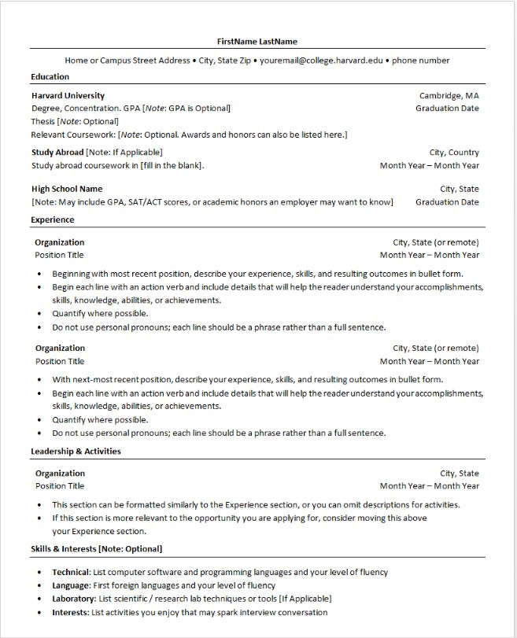

# Frontend Technical Specification (testing webhook)

- Create a static website that serves an html resume.
- Using Codespaces as my IDE

## Harvard Resume Format Considerations
I am a US citizen and downloadable resumes in word/pdf format are recommended to exclude certain pieces of information. I.e. Age, Relationship, etc.

[Harvard Resume Template](https://careerservices.fas.harvard.edu/channels/create-a-resume-cv-or-cover-letter/)

## Resume Format Generation

I am going to use an existing resume that was professionally generated during recent QA and Cloud bootcamp experiences.

I have basic to itermediate knowledge of HTML and CSS, therefore I am using GenAI to support the code generation that I will then manually refactor to my personal specifications.

Prompt to ChatGPT5.1:

'''text
Convert this resume image into HTML.
Do not use a CSS framework.
Use the least amount of CSS tags
'''

This is the [generated output](./docs/html/11.24.25-resume-image-crc.html) that I will refactor.

## HTML Adjustments
- UTF8 will support most languages
- Because I will apply mobile styling to the website, I am including the viewpoint meta tag <meta name="viewpoint" content="width=device-width, initial-scale=1" /> so mobile styling scales normally.
- Will extract styles into its own stylesheet after satisfied with HTML.
- Will simplify HTML markup CSS selector to be as minimal as possible.
- For the HTML page, soft tabs 2 spaces matches Ruby standard tab format.

